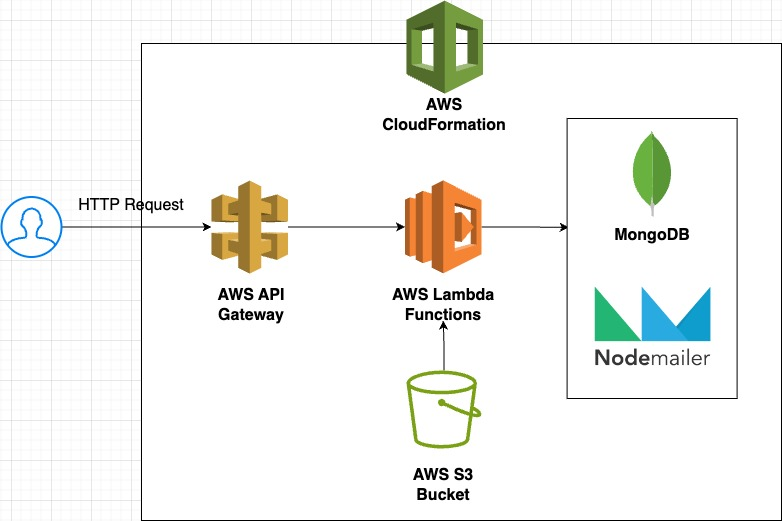

# Serverless Email Sender

This is a serverless application that use AWS Lambda functions to send emails and save on MongoDB database using Prisma.

Basically we will have this architecture on AWS:



The project will use the `serverless` framework to create the all schema and resources that we will need on AWS. In `serverless.yml` file.

## Pre-requisites

- Node >= 18.x
- NPM or Yarn
- Account on AWS
- Account on Atlas MongoDB

## Variables

| Environment    | Description                                         |
| -------------- | --------------------------------------------------- |
| DATABASE_URL   | MONGO DB URL Access                                 |
| PASSWORD_EMAIL | GMAIL password setting on Two Factor Enabler config |

## How to use?

Create your account in `Atlas Mongo DB` and create a project with a name with your preference and create a database.
After the creation you will need create the user and password of your database.

Copy the password and verify if the connection IP is all: `0.0.0.0/0`.

Click on connection and get the url connector like:
`mongodb+srv://<YOUR_USERNAME>:<YOUR_PASSWORD>@serverless-email.d04oriw.mongodb.net/serverless-email`

and set on the `.env` file as `DATABASE_URL`.

Now try to run:

```sh
npx prisma generate
```

To generate the model the prisma schema.

After that you need create a IAM (Identity and Access Management) in you AWS Account.

So access the AWS console and on IAM > Users > Create User.

Create your user and on `Attach policies directly` set the `AdministratorAccess`.

After user created, access to edit the user, click on `Security Credentials` > `Access Key` > `Application running on an AWS compute service`.
Give some description and get and save the `ACCESS_KEY` and `SECRET_KEY` provided.

Now in your terminal insert the follow command to config the credentials:

```sh
npx serverless config credentials --provider aws --key={ACCESS_KEY} --secret {SECRET_KEY} -o
```

And to make the deploy just use

```sh
npx serverless deploy
```

And that's it!

In the logs you probably will see the endpoints created, but you CAN run locally to test, using:

```sh
npm run dev
```
